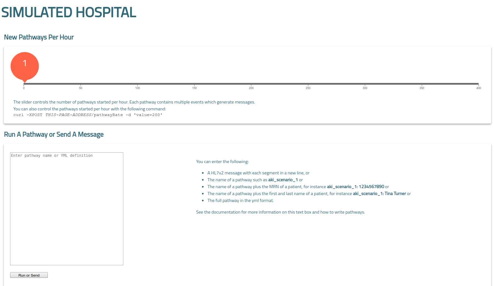

# Dashboard

-   [Open the dashboard](#open-the-dashboard)
-   [Simulation rate](#simulation-rate)
    *   [Set the rate programmatically](#set-the-rate-programmatically)
-   [Run a pathway](#run-a-pathway)
-   [Send a raw message](#send-a-raw-message)

Simulated Hospital includes a built-in web app (called **Dashboard**) to manage
running instances. This document explains how you can manage Simulated Hospital
from your browser.

Using Simulated Hospital's dashboard, you can do the following:

*   Change the message-sending rate of a self-running simulation.
*   Start an ad-hoc pathway or send an HL7 message.



## Open the dashboard

After Simulated Hospital finishes launching, you can visit
http://localhost:8000/simulated-hospital/ in your browser. If you're running
Simulated Hospital on another computer, replace _localhost_ with the hostname or
IP address of the other computer.

To change the TCP port or URL path, launch Simulated Hospital with the
`dashboard_address` and `dashboard_uri`
[command-line arguments](./arguments.md#dashboard).

## Simulation rate

Simulated Hospital typically runs your pathways as part of a self-running
simulation. Each new pathway represents a patient arriving to the hospital. The
application distributes pathways evenly across the hour. For example, if you set
the rate to 10, Simulated Hospital starts a pathway every 6 minutes. To change
how often Simulated Hospital runs your pathways, follow these steps:

1.  Open the dashboard in your browser.
1.  Drag the *New Pathways per Hour* slider to your new rate.

Your new rate only affects starting new pathways. Existing pathways continue
generating and sending new HL7 messages until the pathway complete—even if your
set the rate to zero.

The initial value at startup is determined by the
[`pathways_per_hour`](./arguments.md#pathways) argument.

### Set the rate programmatically

You can set higher message-sending rates from the command line. Run the
following command (you might need to change the host, port, or path) in your
terminal:

```shell
$ curl -XPOST http://localhost:8000/simulated-hospital/pathwayRate -d 'value=2000'
```

## Run a pathway

You might want to run a pathway immediately to demonstrate a feature or test
during development. You can run a pathway by entering one of the following:

*   The name of a [pre-loaded pathway](#pre-loaded-pathways). For example,
    `aki_scenario_1`. Either, append a colon and MRN if you want to update an
    existing patient, or, append a colon with first and last names to override
    the name included in the pathway.
*   The source of a pathway in YAML or JSON format. Simulated Hospital validates
    your data before running. To learn more, read
    [Write pathways](./write-pathways.md).

Here are some examples:

```yaml
# A pathway using ramdomized or built-in data.
aki_scenario_1

# A pathway with patient MRN to update an existing (or create a new) patient.
aki_scenario_1: 123456789012345

# A pathway to create a new patient with the name Jane Doe.
aki_scenario_1: Jane Doe

# Pathway source admitting a patient into the Renal ward, in YAML.
admission_example:
  persons:
      main_patient:
        mrn: "123456789012345"
        first_name: "Elizabeth"
        surname: "Smith"
  pathway:
    - admission:
        loc: Renal

# Pathway source admitting a patient into the Renal ward, in JSON.
{
  "admission_example": {
    "persons": {
      "main_patient": {
        "mrn": "123456789012345",
        "first_name": "Elizabeth",
        "surname": "Smith"
      }
    },
    "pathway": [
      {
        "admission": {
          "loc": "Renal"
        }
      }
    ]
  }
}
```

When you run a pathway from the dashboard, Simulated Hospital runs the pathway
once. If you want to repeatedly run a pathway, add the pathway to the pre-loaded
pathways.

To run a pathway, follow these steps:

1.  Open the dashboard in your browser.
1.  Enter the pathway name or source into the text area.
1.  Click **Run or Send**.

After running a pathway, Simulated Hospital shows the patient's name and MRN
below the text area.

## Send a raw message

To send a raw HL7v2 message, follow these steps:

1.  Open the dashboard in your browser.
1.  Enter the HL7 message into the text area.
1.  Click **Run or Send**.

HL7 messages should look similar to the following example:

```txt
MSH|^~\&|FROM_APP|FROM_FACILITY|TO_APP|TO_FACILITY|20180101000000||ADT^A01|20180101000000|P|2.5|
EVN|A01|20110613083617|
PID|1|843125^^^^MRN|21004053^^^^MRN~2269030303^^^^ORGNMBR||SULLY^BRIAN||19611209|M|||123 MAIN ST^^CITY^STATE^12345|
PV1||I|H73 RM1^1^^HIGHWAY 01 CLINIC||||5148^MARY QUINN|||||||||Y||||||||||||||||||||||||||||20180101000000|
```

Before sending, check the following:

*   Each segment must starts on a new line. The example shows four segments.
*   You can include more than one message, but separate each message with a
    blank line.

Simulated Hospital checks that the raw HL7 message can be parsed before sending
it.
